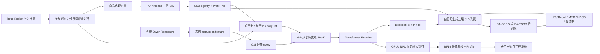

> 适合第一次接触生成式推荐的读者。本文只写当前仓库能够证明的事实，并把“论文方法、公开数据代理、服务器实测、尚未完成”分开。
>
> 论文来源：[OxygenREC-v1](https://arxiv.org/abs/2512.22386)；[OxygenREC-v2](https://arxiv.org/abs/2607.24255)。

# 1. 先建立一张项目地图

一句话概括这个项目：

> 在 RetailRocket 公开行为日志上，自实现 OxygenREC-v1/v2 的核心生成推荐方法，建立可审计的数据、SID、训练、后训练、评测闭环，再把同一 v2 Full 主线从 NVIDIA L20 迁移到 Ascend 950DT，并用固定输入对齐和 Profiler 驱动性能决策。

它不是“京东生产系统复现”。原论文的私有日志、商品多模态特征、线上 reward service、生产 checkpoint 和服务链路没有公开。准确名称应是：

> OxygenREC 论文方法自实现 + 公开数据近似 benchmark + GPU/NPU 迁移与性能评测。



这张图里有两条不同的“慢/快”关系：

- OxygenREC-v1 的 Fast-Slow Thinking：Qwen 在近线生成意图 instruction，在线 Fast 模型只消费缓存后的稠密特征并生成 SID；它不是每个请求都调用大模型。
- OxygenREC-v2 的 Student/Teacher：Teacher 与 Student 共享模型参数，只在训练期额外看到未来交互前缀；线上部署只有 Student。

# 2. 为什么这个项目值得面试官追问

项目的深度不来自名词数量，而来自五条因果链都能落到代码和实验：

| 环节 | 不是只做了什么 | 真正可以讲的判断 |
|---|---|---|
| 数据 | 下载 RetailRocket | 为什么用全局时间边界、为什么同毫秒事件互不可见、为什么 future 只能同 split 且晚于 gold |
| 表示 | 把 item ID 换成 token | RQ-KMeans 的 MSE 与 SID 碰撞并不单调一致，最终按推荐可用性而非重构误差选码本 |
| 模型 | 跑 Transformer | Instruction、IGR、Q2I、目标行为前缀分别改变哪一段计算，梯度能到哪里、不能到哪里 |
| 算法 | 加 RL | SFT/预训练解决“学会生成”，RL/后训练只在可验证信号成立时优化策略；当前收益证据不足也被保留 |
| 工程 | 模型搬到 NPU | 同输入、同 checkpoint、源码哈希、loss、离散输出、梯度、性能协议逐层对齐，并用负 A/B 结果停止错误优化方向 |

项目目前最强的卖点是“能解释失败”：

1. IGR 控制流正确，但公开代理上 repeat lift 长期没有稳定超过随机/最近历史基线，所以冻结调参路线；
2. v2 的行为指令确实改变输出，但小样本没有稳定目标收益，不能把“模块生效”偷换成“指标提升”；
3. EA-TOSD 改变了连续 logits 和少量最终列表，但没有新增目标命中，说明后训练链已执行，不代表策略变好；
4. NPU 融合 AdamW 稳定提升约 2.68%，但低于预设 5% 工程门槛，因此不采纳。

这些负结果比“跑通某个脚本”更能证明你真的理解实验设计。

**思考**：如果面试官问“你的项目指标没有明显涨，为什么还能写在简历上”，怎样回答？

<details>
<summary><strong>参考分析</strong></summary>

先承认证据边界，再说明项目价值来自三部分：论文方法的可审计自实现、公开代理上的因果消融和失败归因、GPU→NPU 的正确性与性能闭环。不要声称质量优化成功；把成果表述为“完成方法复现与迁移，定位公开数据代理的质量瓶颈，并以门槛化 A/B 拒绝低收益优化”。如果岗位更看重推荐效果，就必须补第 9 节的质量实验后再升级表述。

</details>

# 3. 数据链路：从一行日志到监督样本

## 3.1 统一事件结构

入口是 [`src/oxygenrec/data/events.py`](src/oxygenrec/data/events.py)。RetailRocket 的一行：

```text
timestamp, visitorid, event, itemid, transactionid
```

会转成 `InteractionEvent`：

```text
timestamp_ms, source_row, user_id, item_id, behavior, transaction_id
```

`behavior` 只有 `view / addtocart / transaction`。因为数据集没有 exposure/click，项目把 `view` 明确写成 click 的公开代理，而不是假装两者完全相同。

`source_row` 只用于稳定排序，不代表同毫秒内的真实因果顺序。

## 3.2 全局时间切分与防泄漏

[`src/oxygenrec/data/temporal.py`](src/oxygenrec/data/temporal.py) 使用两个全局时间点：

```text
timestamp < train_end                    -> train
train_end <= timestamp < validation_end -> validation
validation_end <= timestamp             -> test
```

构造下一商品样本时满足：

```text
history 中每个事件的时间 < target 时间
```

同一毫秒的事件先全部作为候选 target 判断，再整体加入 history，因此互相不可见。validation/test 可以使用更早 split 的历史，但训练词表只由 train 时段商品建立；默认跳过训练期没见过的目标，冷启动必须另开口径。

这是一个很适合面试展开的问题：随机切分会把未来兴趣和未来商品分布泄漏到训练中，离线指标可能更高，但不能模拟真实上线。

## 3.3 v1 单商品样本与 v2 列表样本

v1 的 `NextItemSample` 是：

```text
严格更早的 history -> 一个 target item
```

v2 的 `ListwiseTargetSample` 按“用户 + UTC 日 + split”聚合，再执行：

1. 同一商品一天内出现多种行为时，只保留 `transaction > addtocart > view` 中意图最强的行为；
2. 同一个列表的目标行为必须相同，因此一个 `I_b` 可以控制整条列表；
3. 列表内原始商品必须不同，不够固定长度的尾部直接丢弃，不能用 padding 伪造监督；
4. history 严格早于列表第一个目标；
5. EA-TOSD 的 future 必须晚于所有 gold target，并限制在同一 split。

这不是论文私有 daily grouping 的完整还原，而是一个能够审计、能够防泄漏的公开代理。

## 3.4 为什么要把商品变成 SID

传统分类器若直接预测数十万商品 ID，输出空间大且没有层次。生成式推荐把商品写成多级 token，例如：

```text
item_4808 -> [185, 73, 113]
```

粗层 token 先决定大区域，细层 token 再逐步定位。当前 [`src/oxygenrec/sid.py`](src/oxygenrec/sid.py) 定义：

- `SemanticID`：不可变三层 code；
- `SIDRegistry`：版本化 `item -> SID` 与 `SID -> items`；
- `PrefixTrie`：每一步只允许真实商品路径上的下一个 code。

当前公开代理先把训练截止前的商品属性做 hashing 向量，再用 residual K-Means 逐层量化。最终冻结的对照是 `width=256 / K-Means++ / seed=17`：在记录的 18,733 个商品上，MSE 约 `0.001678`，colliding-item rate 约 `20.33%`。

关键发现是：把宽度从 256 扩到 512 时，MSE 可以略降，但碰撞反而恶化。K-Means 优化的是重构误差，不直接优化 SID 唯一性或推荐命中，所以码本不能只看 MSE。

碰撞会带来两个边界：

- 两个不同商品可能共享同一个 SID；
- 生成两个相同 SID 不一定等于推荐同一原始商品，当前系统没有在碰撞集合内部继续消歧。

**思考**：为什么合法 SID 比例等于 1，仍然不能说明推荐质量高？

<details>
<summary><strong>参考分析</strong></summary>

PrefixTrie 只保证生成序列能映射到至少一个训练词表商品，相当于“语法正确”。它不保证该商品与用户相关，也不保证列表不重复，更不消除多个商品共享 SID 的碰撞。质量还要看 target 命中、排序、分行为指标和碰撞条件下的 item 级定义。

</details>

# 4. 模型主链：每个张量去了哪里

## 4.1 输入形状

[`src/oxygenrec/data/model_inputs.py`](src/oxygenrec/data/model_inputs.py) 把样本变成：

```text
history_sids               [B, T, 3]
history_padding_mask       [B, T]      # True 表示 padding
history_behavior_ids       [B, T]
target_sids v1             [B, 3]
target_sids v2             [B, N, 3]
behavior_instruction_ids   [B]
long_history_sids          [B, T_long, 3]
```

其中 `B` 是 batch size，`T` 是短历史长度，`N` 是列表商品数，`H` 是隐藏维度，`V` 是每层 SID 词表宽度。

v2 的 `[B,N,3]` 会展平成 `[B,3N]` 的 teacher-forcing token 序列。历史行为 `[B,T]` 描述“用户做过什么”，目标行为 `[B]` 描述“现在要生成 click/cart/order 中哪类目标”，两者不是同一个字段。

## 4.2 `forward()` 的真实顺序

核心入口是 [`OxygenRECModel.forward()`](src/oxygenrec/model.py)。调用顺序可以压缩成五步：

```text
短历史 -> history context
scenario + reasoning + history context -> query [B,Q]
query 与长历史 item vector 做 IGR -> 追加 K 个 SID
Encoder -> memory [B,T+K,H]
Decoder prefix + teacher forcing -> 3N 个 logits [B,V]
```

### Instruction 与 query

`_instruction_prompt()` 返回：

```text
scenario_prompt [B,H]
reasoning_prompt [B,H]
query            [B,Q]
```

`query` 来自 `[scenario; reasoning]` 的 MLP 投影与 L2 归一化，同时服务两个模块：

- Q2I：训练时让 query 靠近真实目标商品；
- IGR：推理/训练时用 query 从长历史里找相关商品。

真实 Qwen 路线不是把自然语言直接送入 Fast 模型。[`src/oxygenrec/llm_reasoning.py`](src/oxygenrec/llm_reasoning.py) 先生成受 schema 约束的 Reasoning，再离线缓存 `[B,2560]` hidden state；Fast 模型通过 adapter 映射到 `H` 维。缺少外部 feature 时也支持 learnable fallback。

### IGR 长历史检索

`_augment_history()` 的形状变化是：

```text
long SID [B,T_long,3]
 -> 三层 embedding 求和 [B,T_long,H]
 -> item_adapter + normalize [B,T_long,Q]

query [B,Q] x long vectors [B,T_long,Q]
 -> cosine scores [B,T_long]
 -> Top-K index [B,K]
 -> gather 原始 SID [B,K,3]
 -> 拼接短历史 [B,T_short+K,3]
```

长历史向量在当前代码里被 `detach()`，因此 NTP 不会穿过离散 Top-K 去训练这条分支；Q2I 是显式提供检索语义监督的关键。

代码还把两条路径显式分开：

- `paper_igr`：只使用论文式 cosine Top-K；
- `agentic_plan`：允许经过白名单编译的 Qwen Plan 对行为、时效、重复与多样性做有界调整。

当前 Plan 已透传 `forward / generate / beam_search / candidate_log_probs`，但它是扩展实验，不应混入 OxygenREC-v1 论文主线成果。

### Encoder

每个历史商品的表示是：

```text
position embedding
+ 三层 SID embedding
+ 可选 history behavior embedding
```

得到 `[B,T(+K),H]` 后进入 `nn.TransformerEncoder`。padding mask 阻止模型读取补齐位置。

### Decoder

v1 为兼容旧 checkpoint 使用：

```text
[I_s, I_r, BOS, 已知目标 SID 前缀]
```

v2 使用论文式：

```text
[BOS, I_s, I_r, I_b, 已知目标 SID 前缀]
```

EA-TOSD Teacher 则在 `I_b` 后插入训练期 future SID 块 `F`。causal mask 保证第 `t` 步只能看到之前的 token，不能偷看后面的 gold SID。

输出有 `3N` 个 level-specific logits，每个形状 `[B,V]`。

# 5. v1：为什么需要 Instruction、Q2I、IGR 与 SA-GCPO

## 5.1 Fast-Slow Thinking

Slow LLM 擅长从复杂历史提炼意图，但逐请求调用成本太高；Fast Encoder-Decoder 延迟低，但仅靠序列模式可能无法表达复杂意图。OxygenREC 的关系不是二选一，而是：

```text
近线 Slow LLM -> 可缓存的 Contextual Reasoning Instruction
在线 Fast Model -> 消费 instruction，实时生成合法 SID
```

当前公开代理只给 Qwen 行为计数、近期行为、重复商品等证据，没有真实标题、类目或图片语义。因此它能判断“高购买意图/重复浏览”，却不知道用户具体喜欢什么商品语义。这是 v1 质量上限的重要原因。

## 5.2 Q2I 的完整目标

OxygenREC-v1 论文 Eq.2 为：

$$
\mathcal{L}_{\mathrm{Q2I}}
= -\frac{1}{B}\sum_{i=1}^{B} q_i^\top t_i
- \lambda_r \log\left(\mathrm{Var}(Q)\mathrm{Var}(T)\right)
+ \lambda_d\frac{1}{B^2-B}\sum_{i\ne j}(q_i^\top q_j)^2.
$$

- 第一项把 query 拉向真实目标 item；
- 第二项防止整个 batch 的表示收缩到一点；
- 第三项减少不同 query 过度相似。

联合目标是论文 Eq.3：

$$
\mathcal{L}=\mathcal{L}_{\mathrm{NTP}}+\lambda\mathcal{L}_{\mathrm{Q2I}}.
$$

当前 [`q2i_alignment_loss()`](src/oxygenrec/model.py) 按这个结构实现，但 item 表示只是三层 SID embedding 的公开代理，不是论文里的 item ID、side feature、商品文本三路拼接。训练脚本逐 batch 检查联合损失恒等式，曾定位并修正日志漏写 Q2I 负号的问题。

## 5.3 IGR 为什么可能“结构正确、效果失败”

IGR 的 Top-K 是离散操作。分数小幅变化但没有跨过排名边界时，取回的 SID 完全不变，因此 NTP 很难稳定训练检索器。当前项目依次验证了 Q2I 初始化、trigger、masked mean、attention pooling、属性 side retrieval；大样本 repeat lift 仍没有稳定超过随机或 recent baseline，所以合理结论是：

> IGR 控制流完成，但 RetailRocket 当前商品语义代理不足以复现收益；继续调 pooling 的边际价值低于改善数据表示。

这正是“根据 bad case 决定下一步”，而不是为了凑模块继续调参。

## 5.4 SA-GCPO 的作用

v1 的 post-training 使用一组 old-policy 候选与统一 reward。论文 Eq.4–9 的核心关系是：

$$
r_{i,t}(\theta)=
\frac{\pi_\theta(y_{i,t}\mid x,y_{i,<t})}
{\pi_{\theta_{old}}(y_{i,t}\mid x,y_{i,<t})},
$$

$$
f_{i,t}(\rho)=\sigma\left(\tau_{i,t}(\rho-1)\right)\frac{4}{\tau_{i,t}},
$$

$$
\Gamma_{adv}(\hat A_i,R_g^*)=
\begin{cases}
0,&\hat A_i>0\ \text{且}\ R_i<R_g^*,\\
\hat A_i,&\text{其他情况}.
\end{cases}
$$

`f` 用平滑门替代硬 clip；`Γ` 会压掉“组内相对看似不错、但连真实目标 reward 都没达到”的伪正优势。当前 [`src/oxygenrec/alignment.py`](src/oxygenrec/alignment.py) 实现该目标，[`src/oxygenrec/rewards.py`](src/oxygenrec/rewards.py) 用合法性、SID 相似、目标命中和多样性构造可审计公开 reward，而不是伪造论文私有线上 ranking service。

# 6. v2：把行为信号内化到生成器

v1 可以在生成后用 reward 区分 click/cart/order，但生成器本身可能仍然 behavior-agnostic。v2 的核心问题是：能否让目标行为从第一步解码就改变候选分布，并用日志中的真实行为提供监督。

## 6.1 Behavior Instruction 与行为加权 NTP

`I_b` 是目标行为 ID 经过保留 token embedding 与两层 LeakyReLU adapter 后得到的 `[B,H]` 前缀。它只进入 Decoder，不改变 Encoder history memory。

论文 Eq.4 的预训练目标是：

$$
\mathcal{L}_{pre}
=\frac{1}{|\mathcal T|}
\sum_{(y_t,b)\in\mathcal T}
w_b\,\mathrm{CE}\left(p_\theta(y_t\mid X,I_s,I_r,I_b),y_t\right).
$$

当前公开代理权重为 `view/cart/transaction = 1.2/1.5/2.0`。[`weighted_ntp_loss()`](src/oxygenrec/model.py) 对 v2 实现的是 `mean(w_b * CE)`，不会再次除以权重和而抵消绝对尺度。

配对消融使用三组：

| 变体 | `I_b` | token weight |
|---|---:|---:|
| Base | 无 | 1 |
| `+I_b` | 有 | 1 |
| Full | 有 | `1.2/1.5/2.0` |

三组使用同一 cohort、同一 batch 顺序，并显式复制可对应初值。结果证明 `I_b` 和权重都改变输出，但单 seed、5K train、32 validation 下没有稳定收益。

## 6.2 EA-TOSD 为什么不是“为了 RL 而 RL”

使用 RL 的前提不是“SFT 已经跑完”，而是出现了 SFT 很难直接表达的训练信号：

- 最终需要优化自回归整条生成轨迹；
- 真实 SID token 命中可以验证，但非常稀疏；
- 训练日志中有部署时不可见的未来交互，可以做 privileged teacher；
- 不希望额外训练一个可能发生 reward hacking 的外部 reward model。

因此 EA-TOSD 同时使用稀疏可验证 reward、未来信息蒸馏和 SFT anchor。

### 几何可验证奖励

对长度 `L=3N` 的候选轨迹：

$$
h_{i,t}=\mathbb I[\hat y_{i,t}=y_t^*],\qquad
\omega_t=\frac{\gamma^{t-1}}{\sum_{j=1}^{L}\gamma^{j-1}},\qquad
R_i=\sum_{t=1}^{L}\omega_t h_{i,t}.
$$

从 `G` 条 on-policy 轨迹中选 reward 最高者 `k`：

$$
\mathcal L_{VR}
=\mathbb E\left[-R_k\sum_{t=1}^{L}
\log\pi_S(\hat y_{k,t}\mid X,\hat y_{k,<t})\right].
$$

前面粗粒度 SID token 权重更高。要注意：命中第一个 token 只是共享粗前缀，不等于完整商品命中。

### Privileged Teacher 与双熵蒸馏

Teacher 与 Student 共享参数，只多看 future prefix `F`。对已选轨迹：

$$
A_t=\log\pi_T(\hat y_t\mid X,F,\hat y_{<t})
-\log\pi_S(\hat y_t\mid X,\hat y_{<t}),
$$

$$
H_t^T=-\sum_{v\in V}\pi_T(v)\log\pi_T(v).
$$

低熵位置用 privilege advantage 做定向自蒸馏：

$$
\mathcal L_{SD}=\mathbb E\left[-\sum_t
\tilde g_t^l\,\mathrm{sg}(A_t)\log\pi_S(\hat y_t)\right].
$$

高熵位置不强迫 Student 追一个 token，而是保持 Teacher 的分布结构：

$$
\mathcal L_{FKL}=\mathbb E\left[\sum_t\tilde g_t^h
D_{KL}(\pi_T\Vert\pi_S)\right].
$$

论文 Eq.13 为：

$$
\mathcal L_{EA\text{-}TOSD}
=\lambda\mathcal L_{VR}+\beta\mathcal L_{SD}+\zeta\mathcal L_{FKL}.
$$

论文同时说明 behavior-weighted SFT 与它并行作为 anchor。当前 [`src/oxygenrec/ea_tosd.py`](src/oxygenrec/ea_tosd.py) 因此实际优化：

```text
0.1 * L_VR + 0.01 * L_SD + 0.01 * L_FKL + 1.0 * L_SFT
```

Teacher 分布和 `A_t` 都 stop-gradient，参数更新只落到部署 Student 的共享 backbone。

**思考**：为什么本轮真实样本全部落入高熵门，不能算“双熵分支都完成了真实数据验证”？

<details>
<summary><strong>参考分析</strong></summary>

因为真实 32 条样本只激活了 high-entropy FKL，low-entropy SD 只在合成单元测试中触发。代码分支正确不等于真实数据分布覆盖。更好的后续实验不是随意改阈值制造覆盖，而是先提高预训练质量和 reward density，再观察固定论文阈值下的熵分布是否自然移动。

</details>

# 7. 评测：每个指标究竟证明什么

| 指标 | 能证明 | 不能证明 |
|---|---|---|
| legal SID rate | 解码路径存在于 registry | 商品相关、列表不重复 |
| SID token accuracy | 三层 token 的局部命中 | 完整商品命中 |
| exact SID recall | 生成 SID 与目标 SID 完全相同 | 碰撞集合内的精确 item 身份 |
| HR@K / Recall@K | 目标 item 是否出现在前 K 的显式映射集合 | 与论文私有候选池数值可比 |
| MRR / NDCG | 命中位置和折损排序 | 线上 UCTCVR/GMV |
| loss | 当前训练目标的拟合程度 | 推荐质量必然提高 |
| throughput / latency | 固定 workload 的设备执行效率 | 没有同协议时的跨实验优劣 |

一个可信的实验至少要冻结：数据切分、样本 cohort、SID registry、候选池、seed、初值映射、batch 顺序、训练预算、beam width、指标定义和代码/input hash。

项目中最有价值的实验设计习惯包括：

- Base、`+I_b`、Full 使用配对 cohort，并检查初值是否真正一致；
- SA-GCPO 的 alignment 与 held-out validation 分开，避免把同 cohort 改善写成泛化；
- EA-TOSD 额外设置同条件 SFT-only，区分共同 SFT 更新与 EA 附加项；
- GPU/NPU 比较记录 commit、tracked dirty、输入哈希和固定样本指纹；
- 性能实验先定义 5% 采纳门槛，再看结果，避免事后修改标准。

# 8. 已完成实验怎样串成一条故事

## 8.1 数据与 SID

1. 合成 RQ 验证 residual 层能降低重构误差；
2. 属性代理 `width=64` 碰撞约 91%，说明“代码能跑”不等于码本可用；
3. `width=256` 大幅降低碰撞；
4. `width=512` 虽有更小 MSE，但碰撞更差；
5. 最终选择 `256/K-Means++`，优先完整 SID 基数和较低碰撞，而不是追最小 MSE。

## 8.2 v1 方法链

- 四组 20K 消融与三 seed 复核：Instruction 均值略高但方差覆盖差值，IGR 两组无稳定收益；
- repeat retrieval 逐步排除随机初始化、trigger、pooling、属性 side feature 等假设后仍失败，于是冻结 IGR 调参；
- 真实 Qwen instruction cache 接入 `IGR + Q2I + NTP`，三 epoch loss 下降、合法率为 1；
- 代表案例显示“IGR 取回目标但 beam 仍失败”，把瓶颈定位到欠训练的 Fast 生成器/融合，而非检索语法；
- 统一 SA-GCPO objective 从 `-0.079652` 到 `-0.017510`，三类 reward/advantage/ratio 轨迹通过，但 held-out 排序指标不变。

## 8.3 v2 方法链

预训练 5K/32 配对消融：

| 指标 | Base | `+I_b` | Full |
|---|---:|---:|---:|
| exact SID recall | 0/64 | 1/64 | 1/64 |
| token 命中 | 12/192 | 11/192 | 11/192 |
| 无重复 SID 列表 | 15/32 | 13/32 | 12/32 |

`I_b` 改变 13/32 条列表，行为权重再改变 3/32 条；模块确实影响策略，但没有稳定收益。

EA-TOSD 32 条真实 future-eligible smoke：

- nonzero reward `9/32`，全零候选组 `23/32`；
- low/high gate 为 `0/1`；
- EA 与 SFT-only 最终离散命中相同；
- 96 个浮点参数张量中 80 个发生变化，greedy 改变 2/32 条列表，但没有新增目标命中。

所以正确结论是“方法级 GPU 复现完成，效果门槛未通过”。

## 8.4 GPU→NPU 正确性

同一 v2 Full 主线在 L20 与 Ascend 950DT 上完成 FP32/BF16 20-step 训练、反向、优化器、checkpoint 恢复和固定 validation。

固定 32 条 validation 的 mean loss：

| 精度 | GPU | NPU | 绝对差 |
|---|---:|---:|---:|
| FP32 | 5.8189945221 | 5.8189883232 | `6.20e-6` |
| BF16 | 5.8189778328 | 5.8184895515 | `4.88e-4` |

两种精度的聚合离散指标一致，合法率都是 1。FP32 的 target/greedy/beam 指纹一致；BF16 的 target/greedy 一致但 beam 指纹不同，所以只能说聚合门槛通过，不能说 BF16 候选逐样本完全相同。

## 8.5 性能调优

先用 batch sweep 找到吞吐膝点，再采短窗口 Profile。Profiler 中的吞吐包含采集和同步开销，不能与无 Profiler 基线直接比较。

真实热点包括：

- dropout 族约 26.05%；
- copy/layout 族约 15.77%；
- FlashAttention 正反向及 transpose 约 12.53%；
- `_local_scalar_dense` 534 次，但 device self time 为 0，只能视为 host-bound 候选。

第一项 A/B 选择融合 AdamW，而不是直接关 dropout，因为关 dropout 会改变正则化语义。匹配 `zero_grad` 后：

| 指标 | AdamW | NpuFusedAdamW | 变化 |
|---|---:|---:|---:|
| 中位吞吐 | 27150.77 | 27879.62 samples/s | +2.6844% |
| 中位 step | 150.8613 | 146.9174 ms | -2.6143% |
| CV | 0.918% | 0.959% | 均稳定 |

收益稳定但低于 5% 门槛，显存变化约 `-0.071%`，且 warmup 后 loss 轨迹不同，因此不替换默认优化器。这是一次完整的“发现热点—提出假设—控制变量—量化收益—拒绝方案”。

## 8.6 当前本地回归

2026-09-26 使用已有 Python 3.11/PyTorch CPU 环境执行：

```bash
/opt/anaconda3/envs/hello-agent/bin/python -m unittest discover -s tests -v
```

结果为 `Ran 132 tests ... OK`，无跳过。它覆盖数据防泄漏、SID/RQ、Instruction/Q2I/IGR、行为指令、listwise 生成、SA-GCPO、EA-TOSD、设备与实验比较逻辑；它不替代 CUDA、Ascend 或真实数据训练证据。

# 9. 还需要补什么实验

结论先说：如果简历主张是“完成论文方法复现与 GPU/NPU 迁移调优”，现有证据已经能支撑；如果想写“显著提升推荐效果”，证据还不够。不要为了显得复杂优先补 Qwen LoRA 或 MoE。

## 9.1 P0：数据表示对照，单位投入价值最高

问题：Qwen 看不到商品语义，SID 又有约 20% 碰撞，当前 IGR/生成质量可能被表示上限卡住。

建议固定时间切分、模型、训练预算和 codebook 容量，只替换 item representation：

| 组别 | 表示 |
|---|---|
| A | 当前属性 hashing |
| B | 训练期行为共现/item2vec |
| C | 公开标题/类目文本编码（数据许可允许时） |
| D | B+C 融合 |

至少报告：RQ MSE、碰撞率、prefix 负载、IGR repeat recall/lift、Base 与 `IGR+Q2I` 的 held-out HR/MRR/NDCG。这个实验能回答“数据为什么这样构造、语义表示怎样影响下游”，比再加一个算法名更有面试价值。

当前阻塞：仓库不包含可分发的 RetailRocket 原始文件与公开商品文本，且本机没有服务器 checkpoint；不能在本轮伪造结果。

## 9.2 P0：v2 大样本多 seed 配对质量实验

只有当目标是升级为“效果优化项目”时才必须补：

1. Base / `+I_b` / Full，至少 3 seeds；
2. validation/test 扩到至少 2,000 条，保证 cart/order 分组有足够样本；
3. 报 paired delta、均值±标准差或 bootstrap 区间；
4. 同时报告 exact SID、token accuracy、列表唯一率和分行为指标；
5. 预先写明“什么结果算通过”，不能只挑某个 cutoff。

它能回答 `I_b` 是稳定改变目标方向，还是只改变错误候选之间的选择。

## 9.3 P1：EA-TOSD 对 SFT-only 的真正增量

在更强预训练 checkpoint 上，以同 cohort、同 seed、同 batch、同 SFT anchor 比较：

```text
SFT-only
vs L_VR
vs L_VR + L_SD
vs 完整 EA-TOSD
```

除最终指标外，必须报告 nonzero reward rate、all-zero group rate、low/mid/high entropy coverage、EA-only/SFT-only 命中变化和 gold log-prob paired delta。若大多数候选组仍为零 reward、真实数据仍不触发低熵门，应先改善基础模型，而不是继续调 RL 权重。

## 9.4 P1：layout/copy 性能 A/B

复用现有 Profile 的 call stack，把 `InplaceCopy/TransData/Memcpy` 映射到具体张量和源码，再选择一个不改变模型语义的改动，例如避免重复 contiguous/layout conversion。沿用现有 `100 warmup + 100 measured + 3 repeats` 和 5% 门槛。

这会继续强化 NPU 工程深度，但优先级低于数据表示与质量闭环，因为已有融合 AdamW 负结果已经足够讲一次性能优化方法论。

## 9.5 暂不优先：Qwen LoRA 与 3B-A1B MoE

- 当前人工查看 6 条 Reasoning 候选，只确认 2 条可保留；21 条自动初筛通过不等于人工 approved。先扩充和审核数据，再做 LoRA，否则面试官一问“标签怎么来的、质量怎样”，链路立刻变弱。
- 3B-A1B 是论文部署规模，不是当前仓库结果。没有多卡、expert routing、all-to-all、负载均衡和稳定 checkpoint 证据时，写进成果会把一个扎实项目变成过度包装。

# 10. 从代码开始复盘的阅读顺序

1. [`src/oxygenrec/data/events.py`](src/oxygenrec/data/events.py)：一行 CSV 如何标准化；
2. [`src/oxygenrec/data/temporal.py`](src/oxygenrec/data/temporal.py)：时间切分、下一商品、daily list 和 future；
3. [`src/oxygenrec/sid.py`](src/oxygenrec/sid.py)：SID、碰撞、registry、Trie；
4. [`src/oxygenrec/quantization.py`](src/oxygenrec/quantization.py)：residual K-Means；
5. [`src/oxygenrec/data/model_inputs.py`](src/oxygenrec/data/model_inputs.py)：对象怎样变成 `[B,T,3]`；
6. [`src/oxygenrec/model.py`](src/oxygenrec/model.py)：按 `forward → _instruction_prompt → _augment_history → _encode → _decode → loss` 阅读；
7. [`scripts/train_retailrocket.py`](scripts/train_retailrocket.py)：v1 数据、训练、beam 与评测入口；
8. [`scripts/train_v2_pretraining_ablation_retailrocket.py`](scripts/train_v2_pretraining_ablation_retailrocket.py)：Base/`+I_b`/Full 配对；
9. [`src/oxygenrec/ea_tosd.py`](src/oxygenrec/ea_tosd.py) 与 [`scripts/train_v2_ea_tosd_retailrocket.py`](scripts/train_v2_ea_tosd_retailrocket.py)：v2 后训练；
10. [`src/oxygenrec/device.py`](src/oxygenrec/device.py) 与 [`src/oxygenrec/migration_alignment.py`](src/oxygenrec/migration_alignment.py)：平台无关模型如何迁移；
11. [`scripts/benchmark_v2_training.py`](scripts/benchmark_v2_training.py)：性能协议；
12. [`实验记录/复现实验日志.md`](实验记录/复现实验日志.md)：理解每次判断为什么改变。

# 11. 简单实践 Demo

## 11.1 跑全量 CPU 回归

```bash
/opt/anaconda3/envs/hello-agent/bin/python -m unittest discover -s tests -v
```

观察重点不是只有 `OK`，而是确认以下测试没有 skip：

- `test_target_behavior_changes_decoder_but_not_encoder`；
- `test_joint_loss_backward_and_masked_igr`；
- `test_low_and_high_entropy_branches_and_backward`；
- `test_future_item_does_not_leak_into_first_item_logits`；
- `test_generation_follows_prefix_trie`。

这组测试验证机制与梯度，不验证真实推荐收益。

## 11.2 追一条 v2 batch 的形状

可在 `tests/test_v2_listwise_generation.py` 的 fixture 上加断点，依次观察：

```text
history_sids       [B,T,3]
target_sids        [B,N,3]
flattened targets  [B,3N]
decoder logits     tuple 长度 3N，每个 [B,V]
generated list     [B,N,3]
```

重点检查第二个商品的真实 token 不会影响第一个商品 logits；项目已有对应测试。

## 11.3 手算一次几何 reward

当 `N=2`、`L=6`、`γ=0.9`，只有第一个 token 命中时：

```text
reward = 1 / (1 + 0.9 + 0.9^2 + 0.9^3 + 0.9^4 + 0.9^5)
       ≈ 0.213420
```

项目真实代表案例得到相同数值。这能帮助你在面试时说明“局部 SID token reward”与“完整商品命中”不是一回事。

# 12. 两个最经典的复盘问题

## 12.1 遇到了什么困难，怎样解决

可以按下面四段讲，而不是只说“调参”：

1. **SID 表示冲突**：MSE 更低不代表碰撞更低；增加 2×2 控制实验，按碰撞和完整 SID 基数冻结码本。
2. **IGR 没收益**：先检查 loss 恒等、梯度和 Top-K，再依次对照随机/recent、初始化、trigger、pooling、属性向量；证据仍失败后停止调参，把根因上移到商品语义代理。
3. **跨设备结果怎么可信**：先固定输入和 checkpoint，比较 loss/logits/梯度/离散指纹，再单独做性能，避免把正确性与吞吐混为一谈。
4. **性能优化是否采纳**：融合 AdamW 有 2.68% 稳定提升，但低于事先 5% 门槛且改变数值轨迹，所以保留负结果、不修改默认实现。

## 12.2 如果再做一次，怎样优化

推荐顺序是：

```text
商品语义与 SID 质量
 -> 更充分的 Fast 模型预训练
 -> v2 大样本多 seed 行为消融
 -> reward density 与真实熵覆盖
 -> EA-TOSD 增量
 -> 多卡 / MoE / 服务优化
```

理由是：当前失败首先发生在表示和基础生成质量。基础模型几乎生成不到目标时，后训练只能在大量零 reward 轨迹上工作；直接扩大 RL 或 MoE 只会放大成本，不会自动补上监督。

**思考**：为什么“先 SFT 再 RL”不是固定仪式？

<details>
<summary><strong>参考分析</strong></summary>

先 SFT 是为了获得有基本概率质量、能产生非零 reward 候选的策略；RL 则处理序列级、不可微或部署目标。如果 SFT 后的候选仍几乎全部零 reward，RL 的比较信号非常稀疏，此时应该回到数据、表示和监督训练，而不是因为流程图上下一步是 RL 就强行继续。

</details>

# 13. 面试时如何守住事实边界

可以说：

- “我基于公开数据完成 OxygenREC-v1/v2 核心方法自实现与代表案例验收”；
- “我把同一 v2 Full 训练链迁移到 L20 和 Ascend 950DT，完成固定输入的 FP32/BF16 正确性门槛”；
- “我通过 Profile 定位热点，并用三次 repeat 的受控 A/B 评估融合 AdamW，因 2.68% 未达 5% 门槛而拒绝上线默认配置”；
- “IGR、`I_b`、EA-TOSD 均证明机制生效，但公开代理上没有稳定质量增益，因此没有把方法通过写成效果提升”。

不能说：

- “复现了京东主表或线上 UCTCVR/GMV”；
- “实现了 3B-A1B MoE”；
- “IGR/EA-TOSD 显著提升指标”；
- “全项目都支持 NPU”——准确范围是 v2 Full 主线，部分旧脚本仍默认 CUDA；
- “GPU/NPU 完全一致”——BF16 beam 逐样本指纹不同，多卡也未验证。

# 14. 一页总结

```text
问题
  多阶段推荐目标不一致；LLM 推理强但在线成本高；行为信号难稳定进入生成器。

数据
  RetailRocket view/cart/transaction
  -> 全局时间切分
  -> 防同毫秒/未来泄漏
  -> 单商品与 daily listwise 样本
  -> 同 split 严格未来前缀。

表示
  属性 hashing 代理 -> RQ-KMeans -> 三层 SID
  -> registry 保留碰撞 -> PrefixTrie 保证合法生成。

v1
  Slow Qwen instruction -> Q2I 对齐 -> IGR 长历史筛选
  -> Fast Encoder-Decoder -> constrained decoding
  -> 公开 reward + SA-GCPO。

v2
  Decoder 目标行为指令 I_b + behavior-weighted NTP
  -> listwise SID generation
  -> verifiable best-of-G + future privileged teacher
  -> low-entropy SD / high-entropy FKL + SFT anchor。

评测
  HR/Recall/MRR/NDCG、SID token/exact、合法率、列表唯一率、分行为指标；
  区分模块敏感性、方法闭环、稳定质量收益。

工程
  同源码/输入/checkpoint 的 GPU-NPU loss、生成、梯度与恢复对齐
  -> BF16 性能基线
  -> Profiler hotspot
  -> 受控 A/B 和采纳门槛。

当前最诚实结论
  方法与迁移链很完整，质量收益证据不足；
  下一步优先改善商品语义/SID，再做 v2 大样本多 seed 与 EA 增量实验。
```
